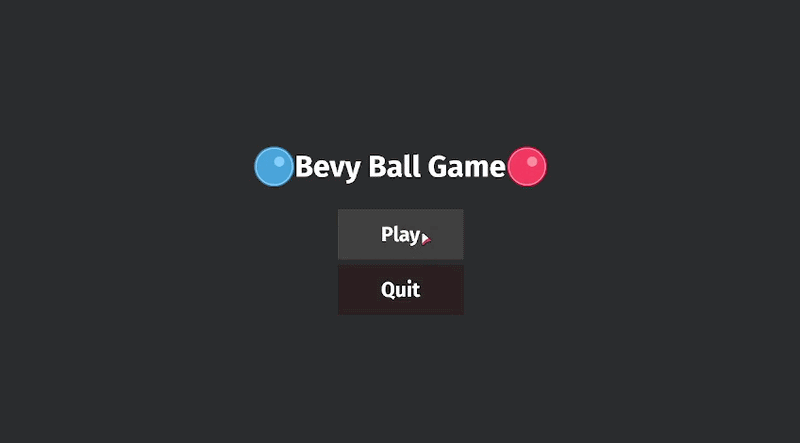

# ⭐ Star Dodge



**Star Dodge** is a mini-game built using **Rust** and the **Bevy Engine**, with the main goal of learning game development, ECS, and system architecture within the Rust ecosystem.

In the game, you control a **blue ball** while:

**Enemies (red balls)** spawn over time
**Stars** appear periodically on the map, and you need to collect them

The objective is to **collect as many stars as possible without getting hit by any enemy**.
If an enemy touches you: game over.

---

## 🎮 Gameplay
- Control a blue player in a 2D environment
- Enemies (red balls) spawn progressively over time
- Stars appear randomly and increase your score
- Getting hit by an enemy results in Game Over

---

## ⌨️ Controls
| Key   | Action              |
| ----- | ------------------- |
| WASD  | Move player         |
| Space | Pause / Resume game |

---

## 🛠️ Tech Stack
- Rust
- Bevy Engine
- ECS pattern
- Cargo

---

## 🎯 Purpose

This project was built to deepen my understanding of:

- ECS (Entities, Components, Systems)
- Game loop and real-time updates
- System orchestration and state transitions
- Structuring scalable Rust applications

---

## ▶️ Running the Project

Make sure you have Rust installed.

```sh
cargo run --release
